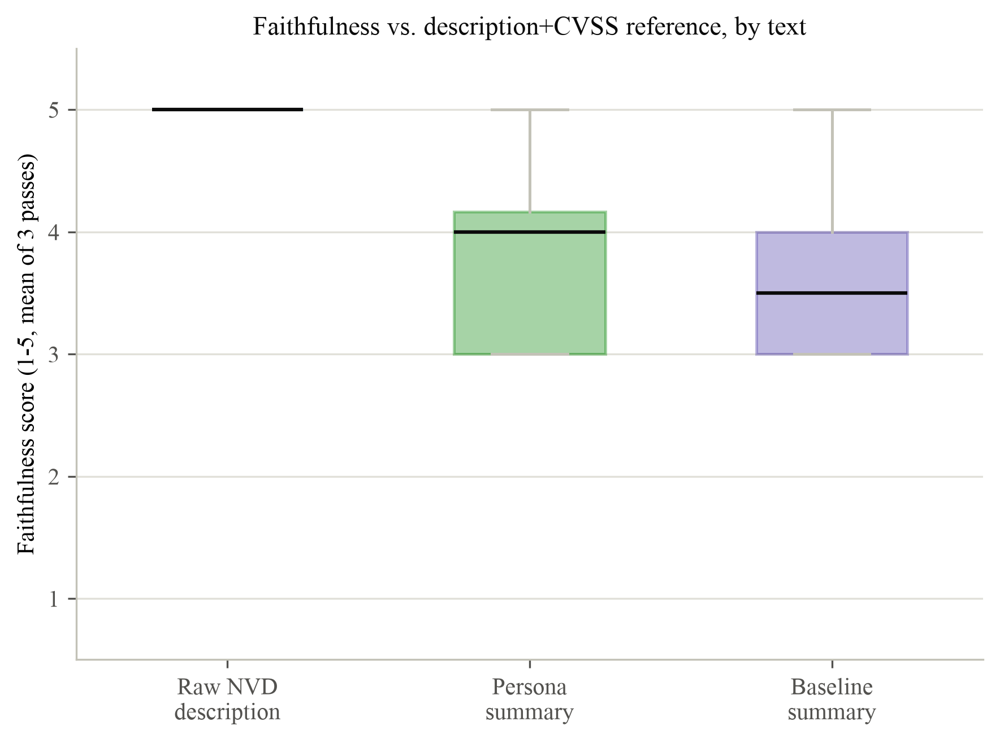
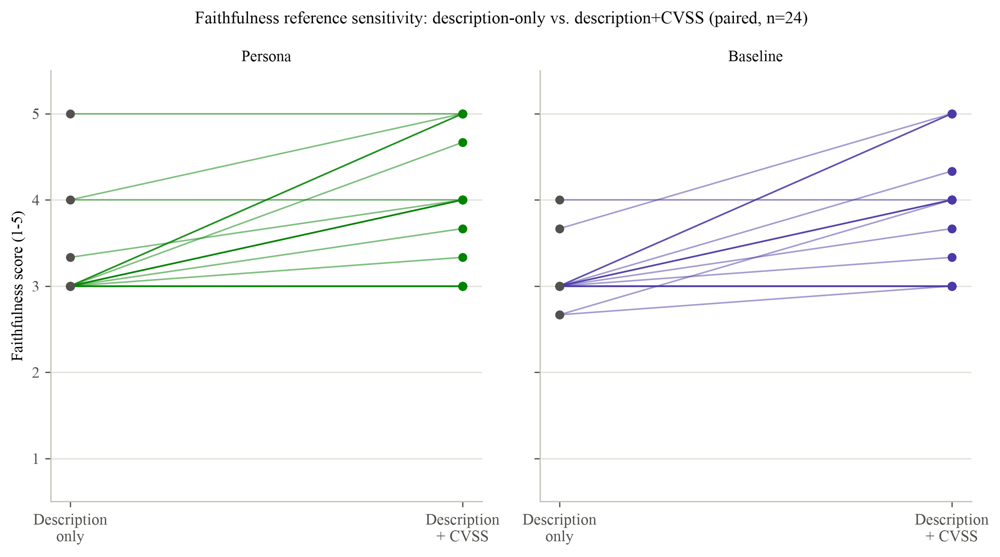

# Faithfulness Sensitivity Check: Description-Only vs. Description+CVSS Reference

Stage 6f. Paper-ready summary of methodology and findings. Full evidence tables and reproducibility detail are in `LLM_JUDGE_FAITHFULNESS_EXT_COMPARISON.md` (this directory) and `METHODOLOGY_LOG.md` ("Stage 6f"); this file is the condensed version for direct use in the write-up.

## Motivation

Stage 6e scored each generated summary's faithfulness against the target CVE's bare `description` field only. Inspecting Stage 6e's judge justifications showed that most "unsupported claim" flags on the persona and baseline arms were the judge correctly applying its rubric (only credit a claim if it is present in the supplied reference) while marking real, sourced CVSS-derived restatements, such as attack vector or required privileges, as unsupported, simply because those fields are not spelled out in the free-text description string, even though the generator was given them directly as structured input and instructed to use them. This raised the question of whether Stage 6e's faithfulness scores reflected genuine fabrication or an artefact of an unnecessarily narrow reference. Stage 6f re-scores faithfulness with an expanded reference to test this directly.

## Methodology

**Reference construction.** The reference text was expanded from `description` alone to `description` plus the CVSS sub-fields the generator was actually given: attack vector, attack complexity, privileges required, user interaction, confidentiality/integrity/availability impact, and CVSS score/severity, all pulled directly from `data/eval_sample.jsonl`. These fields were included because they are native NVD record data, drawn from the same `cvssMetricV31` block on the same NVD record as the description, not external information.

Two categories present in the original generation input were deliberately still excluded from the expanded reference:

- **KEV listed / EPSS score.** External enrichment this project's own pipeline joined onto the record from CISA and FIRST respectively, not something NVD itself publishes. Both prompt templates also explicitly forbid the model from describing or interpreting these values in the summary text. Including them in the faithfulness reference would conflate "faithful to NVD" with "faithful to this project's own enrichment", a different claim.
- **Neighbour CVEs.** Per Stage 6e's original design, a claim supported only by a neighbouring CVE shown as retrieval context must not be credited as faithful. The same rule applies here.

**Rubric, blinding, and multi-pass design.** The faithfulness rubric text and hash are unchanged from Stage 6e (only the reference content differs, not the judge's instructions). The same A/B mapping generated in Stage 6e was reused rather than regenerated, so the same CVEs are anonymised the same way across both faithfulness runs and can be directly paired for comparison. The judge is never told which arm (persona, baseline, or raw NVD) a text belongs to. Each (CVE, arm) was scored 3 times at temperature 0.

**Scope.** Only faithfulness was re-scored (216 new judge calls: 24 CVEs x 3 arms x 3 passes). Comprehension is not reference-based and is unaffected, so Stage 6e's comprehension results stand unchanged. Stage 6e's original (description-only) faithfulness scores were reused directly rather than re-queried, so both reference conditions are directly comparable pass-for-pass under the same model, temperature, and blinding design.

**Judge model:** `gpt-4.1-2025-04-14`, temperature 0, 3 passes per text. 216/216 calls succeeded, 0 failures.

## Findings

### Descriptive statistics

Mean faithfulness score (1-5) per arm, under each reference condition, n=24 CVEs:

| Arm | Description only (Stage 6e) | Description + CVSS (Stage 6f) | Mean difference | Cohen's d (paired) |
|---|---|---|---|---|
| Persona summary | 3.18 (SD 0.48) | 3.82 (SD 0.79) | +0.64 | 0.89 |
| Baseline summary | 3.04 (SD 0.27) | 3.68 (SD 0.76) | +0.64 | 0.88 |
| Raw NVD description (control) | 5.00 (SD 0.00) | 5.00 (SD 0.00) | 0.00 | n/a |

Full descriptive and paired-comparison tables: `LLM_JUDGE_FAITHFULNESS_EXT_COMPARISON.md`. Per-CVE scores: `llm_judge_per_text_faithfulness_ext.csv`. Every individual judge call: `llm_judge_raw_faithfulness_ext.json`.

### Key observations

1. **Both summary arms rose by the same margin (+0.64) with a large paired effect size (d approximately 0.9).** Expanding the reference to include the CVSS fields the generator was actually given closed roughly two thirds of the gap between the summaries and the raw-NVD ceiling.
2. **No CVE regressed under either arm.** The per-CVE paired-slope figure (`llm_judge_faithfulness_original_vs_ext_bullet`) shows every one of the 24 persona scores and every one of the 24 baseline scores moved up or stayed flat when the reference was expanded; none moved down. This is evidence the original, lower scores were suppressed by reference scope rather than reflecting inconsistent summary quality.
3. **The raw-NVD control stayed exactly flat at 5.00/5.00.** This is the intended sanity check: expanding the reference did not simply inflate every score, since the control (text scored against its own content) had nowhere higher to go and correctly showed zero change.

### Figures

- `../figures/llm_judge_faithfulness_ext_bullet.png` (and `.svg`): faithfulness scores under the description+CVSS reference, by arm (raw NVD, persona, baseline).
- `../figures/llm_judge_faithfulness_original_vs_ext_bullet.png` (and `.svg`): per-CVE paired change from the description-only reference to the description+CVSS reference, shown separately for the persona and baseline arms.

## Interpretation for the write-up

Stage 6e's lower faithfulness scores for the persona and baseline arms (relative to the raw-NVD control) should not be read as evidence of fabrication. Stage 6f isolates and quantifies the cause: when the faithfulness reference is expanded to include the same CVSS-derived fields the generator was given, and nothing else, both summary arms recover a substantial share of that gap, with a large effect size and zero regressions across all 24 CVEs. The residual gap after expansion (persona 3.82, baseline 3.68, versus the NVD control's 5.00) is smaller and plausibly reflects genuine interpretive or explanatory content added by the summarisation prompts rather than a reference-scope artefact, though this study does not further decompose that residual. Reporting both the Stage 6e (narrow) and Stage 6f (expanded) faithfulness results together, rather than either alone, gives a more complete and defensible account of what the faithfulness dimension is and is not capturing.
